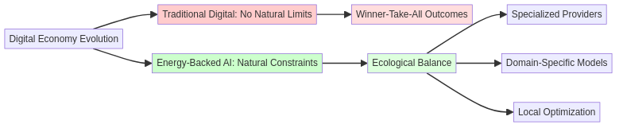
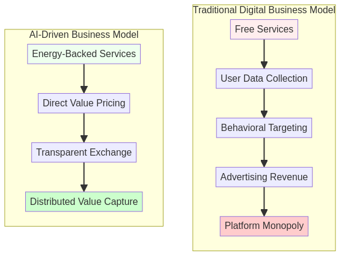
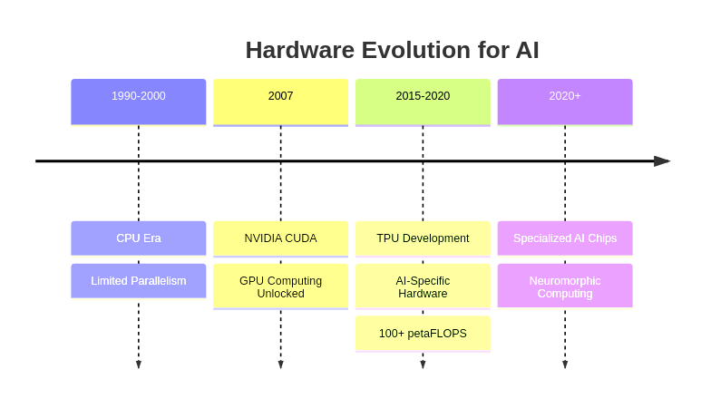

# Mermaid Diagram Generation Service

A Dockerized service that generates Mermaid diagrams via URL requests.

## Prerequisites

- Docker Desktop for Windows 10 or Docker for Linux
- Internet connection for pulling Docker images

## Quick Start for Windows

### One-Click Setup (PowerShell)

You can set up and run the Mermaid service with a single command in PowerShell:

```powershell
irm "https://raw.githubusercontent.com/fionatony/mermaid/main/start.ps1" | iex
```

This script will:
1. Check if Docker is running
2. Clone the repository
3. Build the Docker image
4. Start the container
5. Open your default browser with a sample diagram

## Quick Start for Linux

### One-Click Setup (Linux/bash)

You can set up and run the Mermaid service with a single command in bash:

```bash
curl -sSL "https://raw.githubusercontent.com/fionatony/mermaid/main/start.sh" | bash
```

This script will:
1. Check if Docker is running
2. Clone the repository
3. Build the Docker image
4. Start the container
5. Open your default browser with a sample diagram

### Manual Setup

1. Clone the Mermaid repository:

```bash
git clone https://github.com/fionatony/mermaid
```
2.  Navigate into the mermaid directory:
```bash
cd mermaid
```

3. Build the Docker image:
```bash
docker build -t mermaid-service .
```

4. Run the container:
```bash
docker run -d -p 7777:7777 --name mermaid-container mermaid-service
```

5. Verify the container is running: To check if the container is up and running, use:
```bash
docker ps
```
6. Access the Mermaid Server
Open your browser and navigate to the following URL:
```bash
http://localhost:7777/render?code=graph TD; A-->B; A-->C; B-->D; C-->D;
```
This will render a simple Mermaid diagram. You can modify the code parameter to render different diagrams.

## Usage

Generate a diagram by sending a GET request to:
```
http://localhost:7777/render?code=YOUR_MERMAID_CODE_HERE
```

Example URL:
```
http://localhost:7777/render?code=graph TD; A-->B; A-->C; B-->D; C-->D;
```

### Output Format Options

By default, diagrams are rendered as PNG images. You can specify the output format using the `format` parameter:

```
http://localhost:7777/render?code=YOUR_MERMAID_CODE_HERE&format=svg
```

Supported formats:
- `png` (default)
- `svg`

### Custom Dimensions

You can specify custom dimensions for your diagrams using the `width` and `height` parameters:

```
http://localhost:7777/render?code=YOUR_MERMAID_CODE_HERE&width=800&height=600
```

Both parameters are optional. You can specify either width, height, or both.

### Complete Example

Generate an SVG diagram with custom dimensions:

```
http://localhost:7777/render?code=graph TD; A[Start]-->B{Process}; B-->C[End];&format=svg&width=800&height=600
```

## Example Diagrams

The repository includes several example diagrams in the `samples` directory that demonstrate the capabilities of the service:

1. **Digital Economy Evolution** - A graph showing the evolution of digital economy models
   
   - Mermaid: [`samples/digital_economy.mmd`](samples/digital_economy.mmd)
   - Example URL: `http://localhost:7777/render?code=graph LR; A[Digital Economy Evolution] --> B[Traditional Digital: No Natural Limits]; A --> C[Energy-Backed AI: Natural Constraints]; B --> D[Winner-Take-All Outcomes]; C --> E[Ecological Balance]; E --> F[Specialized Providers]; E --> G[Domain-Specific Models]; E --> H[Local Optimization]; style B fill:#ffcccc; style C fill:#ccffcc; style D fill:#ffdddd; style E fill:#ddffdd`

2. **Business Models Comparison** - A flowchart comparing traditional and AI-driven business models
   
   - Mermaid: [`samples/business_models.mmd`](samples/business_models.mmd)
   - Example URL: `http://localhost:7777/render?code=flowchart TD; subgraph "Traditional Digital Business Model"; A[Free Services] --> B[User Data Collection]; B --> C[Behavioral Targeting]; C --> D[Advertising Revenue]; D --> E[Platform Monopoly]; end; subgraph "AI-Driven Business Model"; F[Energy-Backed Services] --> G[Direct Value Pricing]; G --> H[Transparent Exchange]; H --> I[Distributed Value Capture]; end; style A fill:#ffeeee; style F fill:#eeffee; style E fill:#ffcccc; style I fill:#ccffcc`

3. **Hardware Evolution Timeline** - A timeline showing the evolution of hardware for AI
   
   - Mermaid: [`samples/hardware_evolution.mmd`](samples/hardware_evolution.mmd)
   - Example URL: `http://localhost:7777/render?code=timeline%0A%20%20%20%20title%20Hardware%20Evolution%20for%20AI%0A%20%20%20%201990-2000%20%3A%20CPU%20Era%0A%20%20%20%20%20%20%20%20%20%20%20%20%20%20%3A%20Limited%20Parallelism%0A%20%20%20%202007%20%3A%20NVIDIA%20CUDA%0A%20%20%20%20%20%20%20%20%20%3A%20GPU%20Computing%20Unlocked%0A%20%20%20%202015-2020%20%3A%20TPU%20Development%0A%20%20%20%20%20%20%20%20%20%20%20%20%20%20%3A%20AI-Specific%20Hardware%0A%20%20%20%20%20%20%20%20%20%20%20%20%20%20%3A%20100%2B%20petaFLOPS%0A%20%20%20%202020%2B%20%3A%20Specialized%20AI%20Chips%0A%20%20%20%20%20%20%20%20%20%20%3A%20Neuromorphic%20Computing`

You can use these examples as templates for your own diagrams.

## API Endpoints

- `GET /render?code=<mermaid-code>`: Generates and returns a diagram image (PNG by default)
  - Optional parameters:
    - `format=svg`: Output in SVG format instead of PNG
    - `width=<pixels>`: Specify the width of the output image
    - `height=<pixels>`: Specify the height of the output image
- `GET /health`: Health check endpoint

## Managing the Container

- Stop the container:
```bash
docker stop mermaid-container
```

- Remove the container:
```bash
docker rm mermaid-container
```

## Troubleshooting

If you encounter any issues:

1. Check if the container is running:
```bash
docker ps
```

2. View container logs:
```bash
docker logs mermaid-container
```

## Notes

- The service runs on port 7777
- Temporary files are automatically cleaned up after each request
- CORS is enabled for all origins 